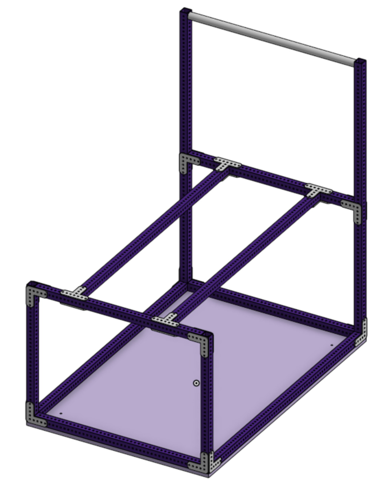
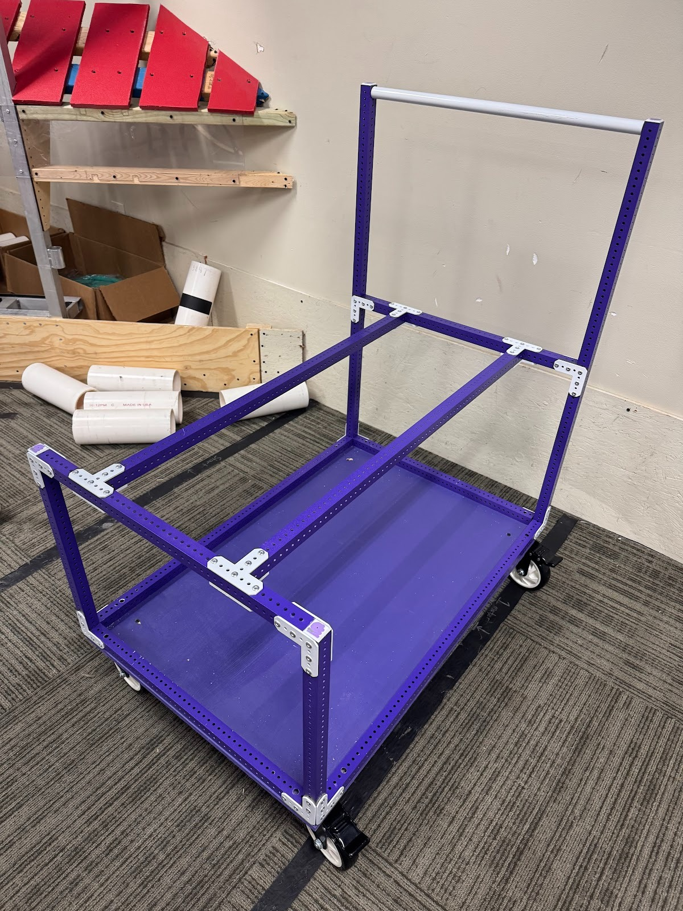

# Spectrum Cart 3.0

We’ve been using a version of this cart since 2021-2022. We have two of them now, and are likely making a third soon.

### [Onshape Link](https://cad.onshape.com/documents/270cd99aba854100e126931a/w/bf09f3d8b03cb80ac17e3e12/e/3b46fb6e8b6538cc32d517cc) 

### Features 

* **Small footprint:** at 2ft x 3ft, it is legal to go onto the field if needed.
* **Adjustable:** can easily adjust the cart height for tall robots, etc. We screw in 2 wood blocks to the top rails to place the robot on; this supports it well and doesn’t scratch the belly pan much.
* **Swerve Access:** The cart doesn’t have a top deck, so we can easily work on our swerve modules under our robot while it is on the cart. Wheel swaps, cleaning, etc are very easy.
* **Customizable:** Easily mounts other accessories to the cart. We have made mounts to attach our driver station to the handle side. We have thought about others, such as water bottle holders, etc., but haven’t made them.
* **Common FRC Build Materials and Practices:** uses the same techniques, materials, and fasteners that we use to build our robots.
* **Bottom shelf with lip:** The rail on the bottom shelf prevents items from rolling off; we can have bolts and tools down there without them falling off as we move.
* **Open front and back:** Allows toolbox drawers at the front or back. We are planning to use a StackTech 3 Drawer box.

### Photos 

&#x20;

\

### Materials 

* **1x1 Square Extrusion:** can use pre-punched or regular and add a few holes. We have used REV 1x1 for both our carts. (#TeamREV)
* **90-degree and T gussets:** can use any vendor or make them custom. Can use the 90s for all of them if you want.
* **⅜” or ½” Plywood base:** Simple rectangle cut out with some holes for the casters.
* **⅞” Round tube:** for the handle with star nuts pressed in. Could use more square tube, but it’s not as comfortable to push/pull.
* **4x swivel+locking casters:** Having all 4 wheels swivel and brake is pretty convenient for sliding through narrow pits, etc. The 5” wheels are a good compromise on size. We prefer solid wheels to pneumatic, so we never have to deal with flats or blowouts. We bolt them on with 10-32 hardware and washers so that we always have easy access to those tools or spare hardware if needed. These are similar to what we use - [Amazon.com](https://amzn.to/3YLjnjT)
